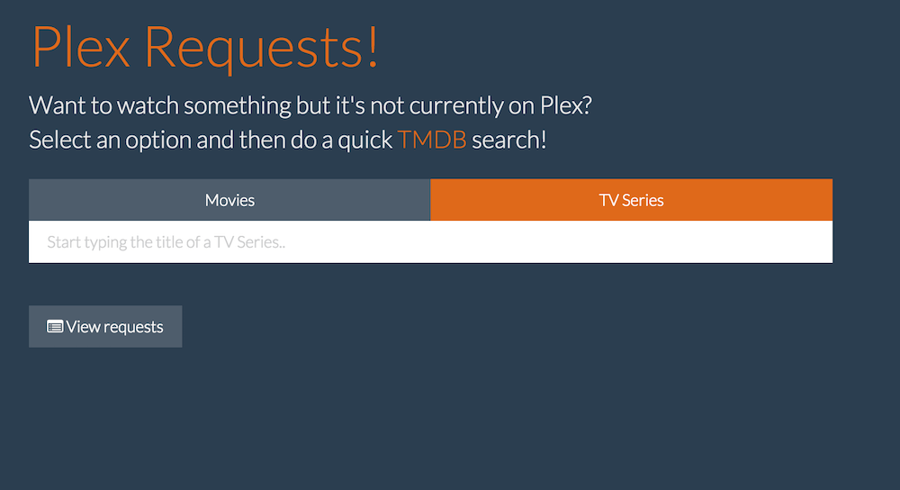
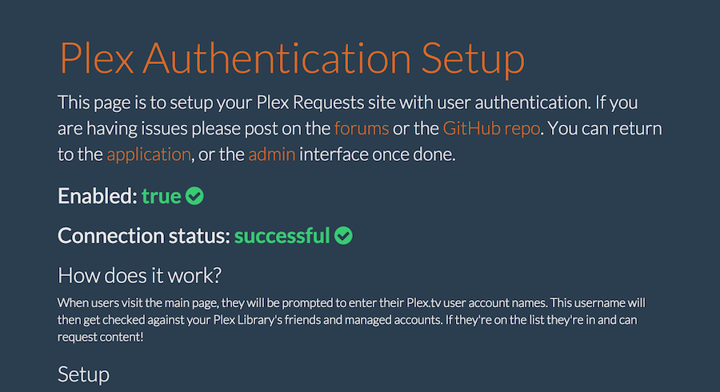

#Plex Requests - Meteor Style!

This is [Plex Requests](https://github.com/lokenx/plexrequests) but written with Meteor! It's been updated with [SickRage](https://github.com/SiCKRAGETV/SickRage) and [Sonarr](https://sonarr.tv/) (currently beta) intergration, includes support for authentication via Plex.tv usernames, and TV requests!

**A project website has been setup using [GitHub pages](http://plexrequests.8bits.ca/), please visit it for more details!**

##Features
*   Users can easily search the [TheMovieDB](https://www.themoviedb.org/) for content to request
*   Easily accessible list of requested movies and TV series
*   Simple and easy user authentication lets only those you want in
*   [Couch Potato](https://couchpota.to/) integration for automatic downloads of movies
*   [SickRage](https://github.com/SiCKRAGETV/SickRage) and [Sonarr](https://sonarr.tv/) integrationed for automatic TV Series downloads
*   [PushBullet](https://www.pushbullet.com/) or [PushOver](https://pushover.net/) notifications to keep up to date with requests
*   Test pages are now setup that should help diagnose and troubleshoot connectivity issues, links can be found in admin interface

##Installation
Installation is straightforward: please update to Meteor 1.1 (for Windows support), clone the repo, `cd` into the directory, and run `meteor`. For Windows users check out this [blog post](http://8bits.ca/blog/installing-plexrequests-windows/) for installation instructions using Git!

On first run navigate to `http://localhost:3000/admin` and create an admin account with an username and password. **If this isn't done someone else can create the admin account to your applications.** This account is only used for logging in, email integration isn't enabled. Once logged in, please visit the status and setup pages for the various services as linked to in the admin interface to get started.

##FAQ
Please visit the projects [GitHub page](http://plexrequests.8bits.ca/) for [FAQ page](http://plexrequests.8bits.ca/faq)

##Contributors
Plex Authentication: [@jeradin](https://github.com/Jeradin)  
Test Pages: [@jrudio](https://github.com/jrudio)  
Improved TV Requests: [@drzoidberg33](https://github.com/drzoidberg33)

##License
This application is licensed under The MIT License. The Plex logo, and name are copyright of Plex Inc.
