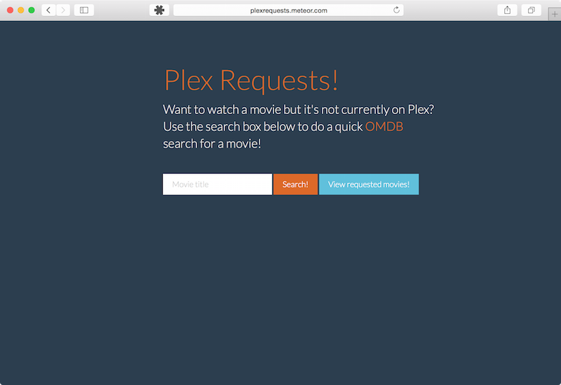

#Plex Requests - Meteor Style!

This is Plex Requests but written with Meteor! It's been updated with basic [Couch Potato](https://github.com/RuudBurger/CouchPotatoServer) intergration; when movies are added it does a check for the movie's status in the CP database. To enable this, you need to enter your CP IP and API key into the plexrequests-meteor/server/server.js file, as well a being on the LAN as your CP server. I'm looking into a way to get Plex Requests to do a periodic check-in to update the requested list.

For more details regarding Plex Requests view the original Django repo [here](https://github.com/lokenx/plexrequests) and a demo of this version is hosted on Meteor at [http://plexrequests.meteor.com](http://plexrequests.meteor.com).
