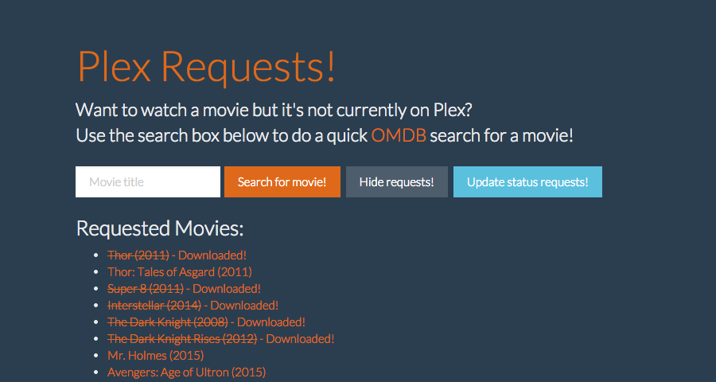

#Plex Requests - Meteor Style!

This is Plex Requests but written with Meteor! It's been updated with [Couch Potato](https://github.com/RuudBurger/CouchPotatoServer) intergration; when movies are added it does a check for the movie's status in the CP database and updates the download status according; it will also add the movie to CP's Wanted List if the movie isn't downloaded or on the list already. To enable this, you need to enter your CP IP and API key into the plexrequests-meteor/server/server.js file, as well a being on the same LAN as your CP server. ~~I'm looking into a way to get Plex Requests to do a periodic check-in to update the requested list.~~ When users are viewing the requested movie list they are given an option to update the list against CP to see if anything new has been downloaded. I'm  undecided if I'll add this to the server-side automatically via a cronjob or something.

For more details regarding Plex Requests view the original Django repo [here](https://github.com/lokenx/plexrequests) and a demo of this version is hosted on Meteor at [http://plexrequests.meteor.com](http://plexrequests.meteor.com).
