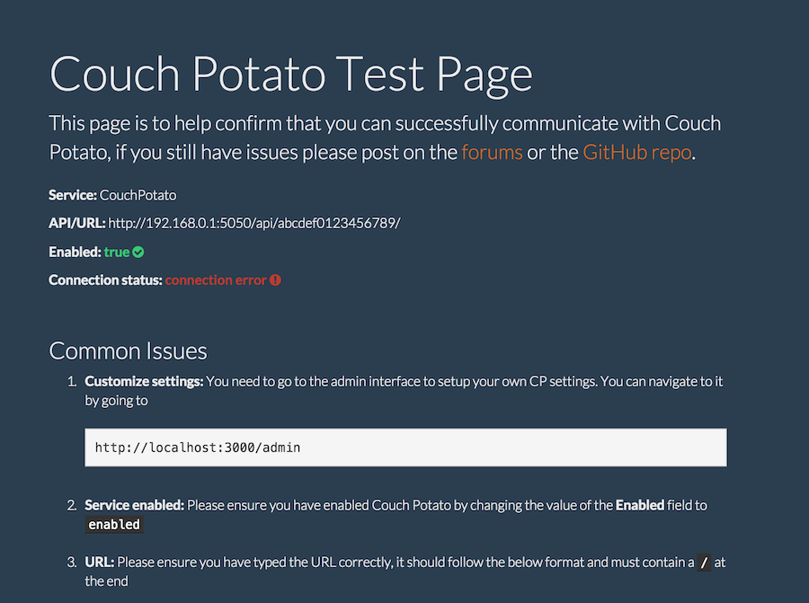

#Plex Requests - Meteor Style!

This is [Plex Requests](https://github.com/lokenx/plexrequests) but written with Meteor! It's been updated with [Couch Potato](https://github.com/RuudBurger/CouchPotatoServer) intergration and includes a new admin interface courtesy of the [Houston](https://github.com/gterrono/houston) package.

A project website has been setup using [GitHub pages](http://8bits.ca/plexrequests-meteor)!

##Features
* **NEW** Accounts are here! User's simply need enter their Plex.tv usernames to gain access
* Users can search the [OMDB](http://www.omdbapi.com/) for movies to request
* Requested movies are easily available for users to see, and downloaded content gets cleaned up from the list
* Adminitrators can view and edit requested movies using the admin interface, as well as configure settings
* Couch Potato and PushBullet can be integrated via the admin interface
 * With CP enabled, movies are added to CP Wanted List if not present already, and an option to update movies download status is provided to users
 * **NEW** Movies are also first checked to see if they're already downloaded in CP and let's the users know as such
 * PushBullet notifications can be sent to give you a notification when a movie is requested
* **NEW** A CP test page is now setup at `/couchpotato` that should help diagnose and troubleshoot connectivity issues

##Installation
Installation is straightforward: please update to Meteor 1.1 (for Windows support), clone the repo, `cd` into the directory, and run `meteor`

On first run navigate to `http://localhost:3000/admin` and create an admin account with a username and password. **If this isn't done someone else can create the admin account to your applications.** This account is only used for logging in, email integration isn't enabled. Once logged in, go to the `setting` collection and enable either of the services if desired.

To setup Plex Authentication, which is required currently, please nagivate to `http://localhost:3000/plex` and login with your Plex.tv account or follow the manual instructions. **This MUST be done to allow users access to request content**.

For PushBullet just your API key is required. For CouchPotao you need to enter the full IP address of your server, including port and API. **Please ensure there's a trailing `/` at the end of the URL.** Please see below for an example:  

    http://192.168.0.0:5050/api/abcdef1234567890/

##Additional Information
If you're having trouble with Couch Potato please visit `http://localhost:3000/couchpotato` (or your own URL) for some assistance, it requires you to be logged in to the admin interface to access. If you still require any assistance or have questions please option an issue. Some good info is also available on the Plex forums [here](https://forums.plex.tv/index.php/topic/151899-plex-movie-requests/).

##FAQ
####What's this new account business?
After some thought, and with the help of [@jeradin](https://github.com/Jeradin) users now require authentication to make requests. They just need their username so no passwords are require for ease of entry. A local token is also saved for future visits and more integration with user accounts will be coming.

####Can I turn authentication off?
Currently no, it was an all or nothing change to the code. This may change in the future or it may not, we'll see how things go.

####How often are movies removed from the requested list?
Movies are kept on the list until their download status gets changed to true. Once their status is true they are removed from the list if their requested date is older than 14 days

####Doesn't that mean movies requested a long time ago will never show up in the list as downloaded?
Yes, it does. To combat this, if a user requests a movie that has alerady been requested but has since been downloaded, instead of the typical notice that the movie has already been requested, they will get notified that the movie has already been downloaded.

####Why can't I find the movie I want? The search results suck!
Currently, I am using the [OMDB API](http://www.omdbapi.com) for search results. I'm looking into possibly switching to something else so if you've a recommendation let me know!

####Can I run this on my Synology/QNAP/Rasberry Pi?
Your deployment options are limited to platforms that [Meteor](https://www.meteor.com) supports, so the short answer is no. However, if you're so inclined, and your platform supports [Node.js](https://nodejs.org/) and [MongoDB](https://www.mongodb.org/), you should be able to get it running using the [demeteorizer](https://github.com/onmodulus/demeteorizer).

####Can I password protect access to make movie requests?
Currently anyone who knows the address of where you are hosting Plex Requests can submit requests. This obviously isn't ideal for many people. I chose not to implement user accounts (besides the admin one) because I didn't want users to deal with another login or to link a social media account to the application. I'm thinking of adding an option to allow the admin user to accept or reject requests from within the admin interface. If you feel strongly either way please open an issue!

##Contributors
Plex Authentication: [@jeradin](https://github.com/Jeradin)
##License
This application is licensed under The MIT License. The Plex logo, and name are copyright of Plex Inc.
