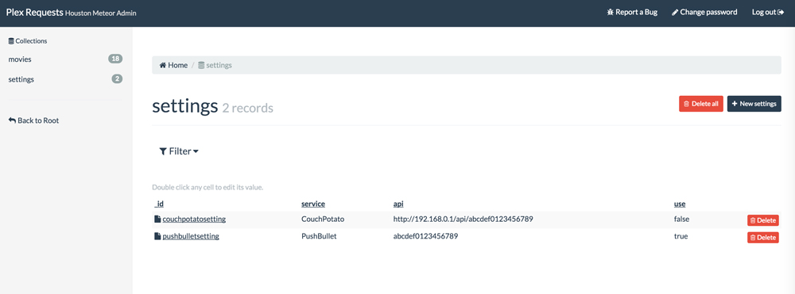

#Plex Requests - Meteor Style!

This is [Plex Requests](https://github.com/lokenx/plexrequests) but written with Meteor! It's been updated with [Couch Potato](https://github.com/RuudBurger/CouchPotatoServer) intergration and includes a new admin interface courtesy of the [Houston](https://github.com/gterrono/houston) package.

Demo of this version is hosted on Meteor at [http://plexrequests.meteor.com](http://plexrequests.meteor.com). I'll look into adding a demo admin account for viewing that too.

##Features
* Users can search the [OMDB](http://www.omdbapi.com/) for movies to request
* Adminitrators can view and edit requested movies using the admin interface, as well as configure settings
* Couch Potato and PushBullet can be integrated via the admin interface
 * With CP enabled, movies are added to CP Wanted List if not present already, and an option to update movies download status is provided to users
 * PushBullet notifications can also be sent to give you a notification when a movie is requested

##Installation
Installation is straightforward. Please update to Meteor 1.1, clone the repo, `cd` into directory, and run `meteor`

On first run navigate to `http://localhost:3000/admin` and create an admin account with a username and password. **If this isn't done someone else can create the admin account to your applications.** This account is only used for logging in, email integration isn't enabled. Once logged in, go to the `setting` collection and enable either of the services if desired.

For PushBullet just your API key is required. For CouchPotao you need to enter the full IP address of your server, including port and API. Please see below for an example:  

    http://192.168.0.0:5050/api/abcdef1234567890

##Additional Information
If you require any assistance or have questions please option an issue. Some good info is also available on the Plex forums [here](https://forums.plex.tv/index.php/topic/151899-plex-movie-requests/).

##License
This application is licensed under The MIT License. The Plex logo, and name are copyright of Plex Inc.